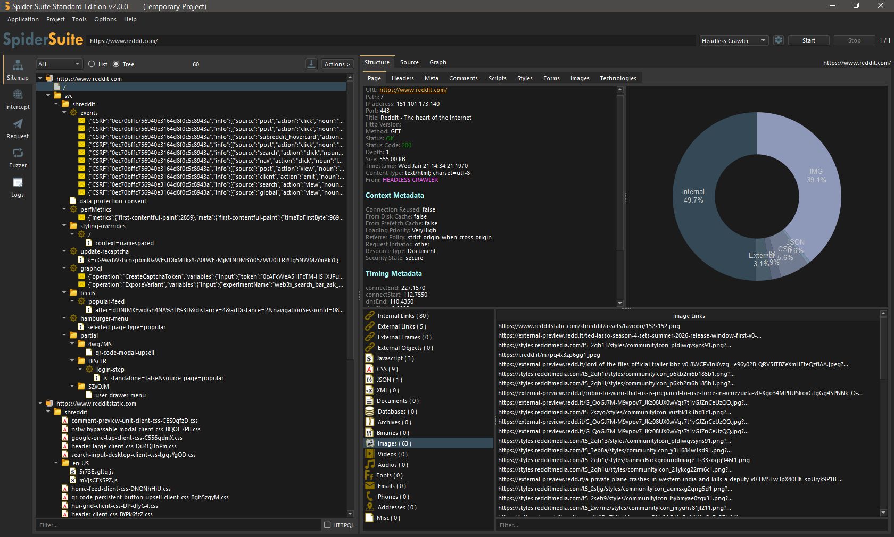

    

    
    
    
    

  •
  <a href="https://github.com/orgs/spidersuite/projects/1">Roadmap</a> 

SpiderSuite is an advance cross-platform and multi-feature web crawler designed for security professionals. 
For more information visit SpiderSuite's [website](https://SpiderSuite.io).

    

# Installation and Usage
Spider Suite is designed for easy installation and usage even for first timers.

- First, [download](https://github.com/spidersuite/SpiderSuite/releases) the package of your choice.

- Then [install](https://github.com/spidersuite/SpiderSuite/wiki/Installation) the downloaded SpiderSuite package.

- See [First time crawling with SpiderSuite](https://spidersuite.io/blog/beginer-guide/) article for tutorial on how to get started.

For complete documentation of Spider Suite see [wiki](https://github.com/spidersuite/SpiderSuite/wiki).

# Contributing 

You can help by reporting [bugs](https://github.com/spidersuite/SpiderSuite/issues), requesting new [features](https://github.com/spidersuite/SpiderSuite/issues), improving the [documentation](https://github.com/spidersuite/SpiderSuite/wiki) & writing articles.

For More information see [contribution guide](CONTRIBUTING.md).
